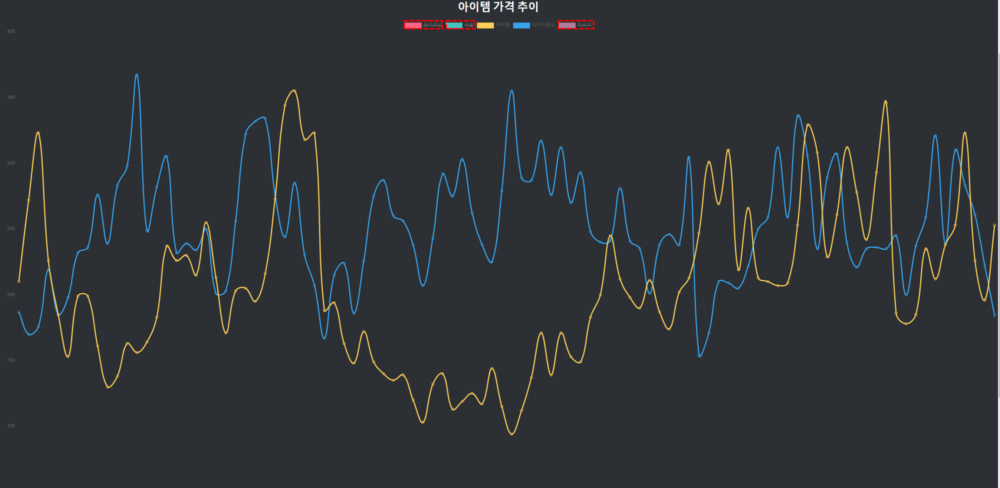

# 아이템 시세 그래프 보기

원더봇의 아이템 시장을 즐겁게 이용하시고 계시면 좋겠네요

하지만 이게 어떻게 값이 바뀌는지 전혀 모르시겠죠?

그런 분들을 위해 가격 변동 그래프를 제공해드리고 있습니다.

데이터베이스에 최대 100개의 변동값까지 저장되기에 그만큼 그래프에서 보실 수 있어요

## 어떻게 하면 되죠?

[원더봇 그래프 페이지](https://wonderbot.xyz/stocks)로 접속합니다.
그러면 대부분의 값들을 그래프로 확인 하실 수 있습니다.

## 너무 복잡해요..

그래프가 너무 복잡하시죠? 또는 두 개나 세 개 등 특정한 개수의 아이템만 비교하고 싶으시다고요?

당연히 가능합니다.

원하는 값을 눌러서 끄거나 킬 수 있습니다.

## 안녕히가세요

그럼 다시 열심히 투자해보세요~!