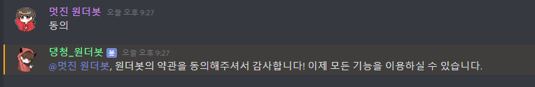

# 원더봇 시작하기

안녕하세요! 원더봇의 유저가 되신 것을 진심으로 환영합니다.
당신과 함께 되어 정말 신나는 마음으로, 원더봇의 이런 저런 것들을 함께 살펴보기 위해, 이 도움말을 준비하였습니다!
이 도움말을 끝까지 읽으시면, 틀림없이 원더봇을 어려움 없이 사용하실 수 있을꺼에요!

원더봇은 다음 두 가지 방법으로 사용해보실 수 있습니다.

1. 공식서버에서 사용해보기
2. [서버로 초대하기](/docs/wonderbot/invite)

**공식 서버에서 사용하기**

공식 서버는 상단 메뉴바에 있는 `디스코드` 아이콘을 눌러 접속할 수 있습니다!
아니면, [이곳](https://invite.gg/wonderbot)으로 접속하실 수도 있어요!

## 약관 수락하기

원더봇을 처음 사용하신다고요? 약관에 동의하셔야합니다! 뭔가 어려워보이지만, 무척 쉽습니다.
~~누워서 떡 먹기라고요~~

1. 원더봇이 있는 아무 곳(DM을 제외한)이나 가서 당신의 핸드폰에 있는 시리를 부를때 처럼 "원더야" 하지는 않고,
`.가입` 명령어를 입력해주세요! 꼭 가입 명령어는 아니어도 되지만 아무튼요!

2. 가입 명령어를 입력하시면 당신의 원더봇이 약관에 동의하지 않았다고 알려줄꺼에요.
    

3. 이제 그렇다면 `동의`를 입력하시면되요!

    > 동의를 입력하는 순간 이용약관과 개인정보취급방침에 동의하게 되니, 꼭 확인해주세요!

4. 동의를 입력했다면, 당신도 원더봇의 유저랍니다! ~~(오 예 신난다!)~~
이제 모든 명령어를 사용하실 수 있어요!
    

## 처음 명령어 써보기

처음 명령어를 사용해본다면 뭐가 있는지 알 수가 없죠..
그런 여러분들을 위해 도움 명령어가 있어요!
지금 당장 `.도움` 만 작성하시면 되요!
그렇다면, 원더봇에 뭐가 있는지 바로 알 수 있어요
    

명령어는 시도 때도 없이 업데이트되니 항상 공지를 주시하고, 도움 명령어를 확인해보세요!

## 돈 기능 써보기

원더봇의 하이라이트이자, 가장 유명한 **돈 기능**을 사용해볼까요?
돈 기능은 다음 몇가지 명령어만 알면 되요!

- .돈
- .돈받기
- .올인
- .슬롯머신

아래 명령어는 가장 기본적인 명령어에요
이 외에도 많은 명령어가 있으니 확인해보세요.

원더봇의 돈 기능은 원더봇 내에 가상화폐인 **원** (WBW) 을 사용한답니다.

### 돈받기

해당 명령어로는 1시간마다 `.돈받기` 명령어로, 100원씩 받을 수 있어요!

하지만, 이렇게 해서는 돈을 부릴 수가 없죠..
그래서 도박 명령어가 있답니다! 인생은 한 방이죠.

### 올인

올인 명령어는 현재 모든 잔고를 **1/2** 의 확률로 초기화되거나, 2배가 됩니다
자신의 모든 돈을 거는 대신, 잔고를 2배로 불릴 수 있는 아주 좋은 기회죠.

#### 연속 성공

위험을 무릅쓰고 여러 번의 올인을 성공한다면, 큰 보상이 따릅니다.

실패 없이 올인을 연속으로 성공 할 때마다 연속 카운트는 올라갑니다.

연속 카운트가 올라간다면 다음과 같은 공식으로 돈을 지급해드립니다.

##### 공식

성공 배당금은 다음 공식을 따릅니다

