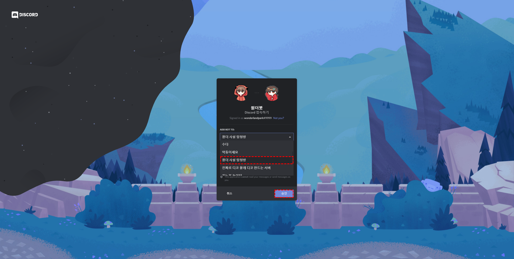
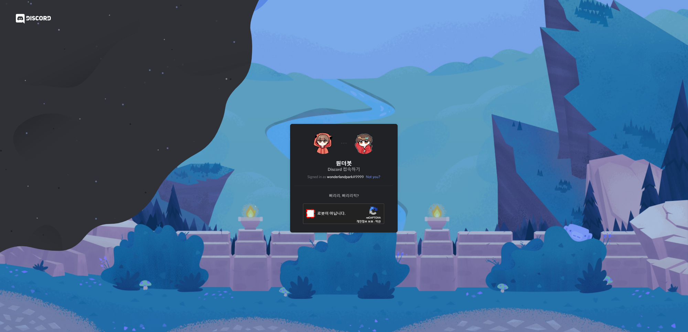
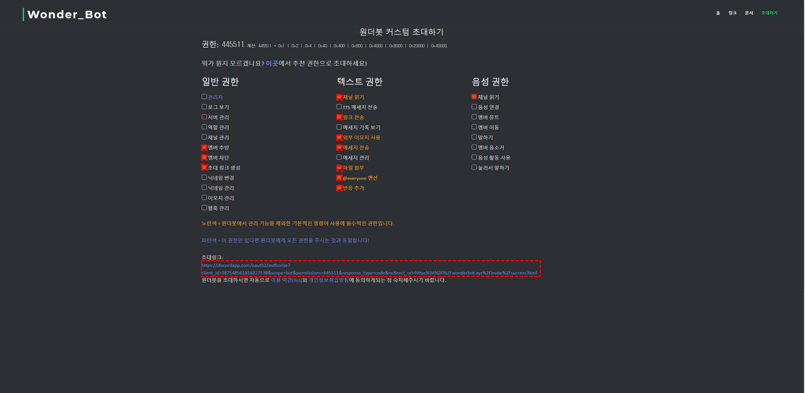

# 원더봇 초대하기

원더봇을 본인 서버에 추가하는 방법은 두 가지로 존재합니다

  - [추천 권한으로 초대](#%ec%b6%94%ec%b2%9c-%ea%b6%8c%ed%95%9c%ec%9c%bc%eb%a1%9c-%ec%b4%88%eb%8c%80)
  - [커스텀 권한으로 초대](#%ec%bb%a4%ec%8a%a4%ed%85%80-%ea%b6%8c%ed%95%9c%ec%9c%bc%eb%a1%9c-%ec%b4%88%eb%8c%80)

## 추천 권한으로 초대

1. [원더봇 **빠른 초대**](http://wonderbot.xyz/invite/ez.html) 페이지에 접속합니다.

2. `초대하기` 버튼을 클릭합니다.

3. 디스코드 Oauth 인증 페이지로 연결되면, 본인의 서버를 선택한 후, 승인 버튼을 클릭합니다.

   

4. `로봇이 아닙니다`를 클릭합니다.
   

5. 본인의 서버에서 **원더봇**을 만나보실 수 있습니다!

## 커스텀 권한으로 초대

1. [원더봇 **커스텀 권한 초대**](https://wonderbot.xyz/invite) 페이지에 접속합니다.

2. 본인이 원하시는 권한을 자유롭게 선택하신 후, 아래의 초대링크를 클릭해주세요!

   

3. 디스코드 Oauth 인증 페이지로 연결되면, 본인의 서버를 선택한 후, 승인 버튼을 클릭합니다.

   

4. `로봇이 아닙니다`를 클릭합니다.
   

5. 본인의 서버에서 **원더봇**을 만나보실 수 있습니다!

지금부터 원더봇을 본인의 서버에서 즐겨보세요!